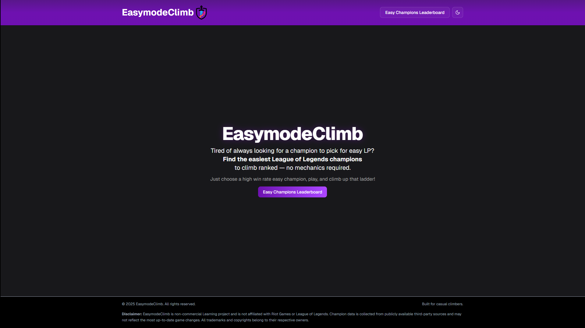

# 🧠 EasymodeClimb

_EasymodeClimb is a League of Legends companion tool that recommends champions that are easy to play and strong in the current meta._

> “What champ should I play to climb — without needing insane mechanics?”

## Implementation

You can view the live version of the website by clicking the image below:

---

## 🔧 Tech Stack

| Layer    | Tech                        | Why?                                     |
| -------- | --------------------------- | ---------------------------------------- |
| Frontend | Next.js 15 + App Router     | Modern, SEO-friendly, flexible           |
| UI       | Tailwind CSS + shadcn/ui    | Fast styling and solid component library |
| Backend  | Next.js Route Handlers      | Built-in API handling                    |
| Database | PostgreSQL Neon             | Relational                               |
| Scraper  | (Playwright)                | For scraping                             |
| Charts   | Recharts or TanStack Charts | For win rate history and stats           |
| Hosting  | Vercel                      | Simple and scalable deployment           |

---

## ✅ MVP Features Checklist

### 🧭 Core Pages

- [ ] `/` - Home Page (intro + top champs preview)
- [ ] `/easy-recomended-champions` - Champion Explorer with sorting/filtering
- [x] `/404` - Custom Not Found Page

---

### 🗃️ Database (PostgreSQL)

- [x] Define schema:
  - [x] Champion
  - [x] ChampionStats (by patch)
- [x] Seed with initial data from scraper
- [x] Write queries for API consumption

---

### 📡 API Routes (Next.js Route Handlers)

- [x] `/api/champions` – All champions
- [x] `/api/easychampions` – Ranked “easy” champs

---

### 🎨 UI/UX

- [x] Use Tailwind + shadcn/ui components
- [x] Mobile-responsive layout
- [x] Loading
- [x] Light/dark mode

---
